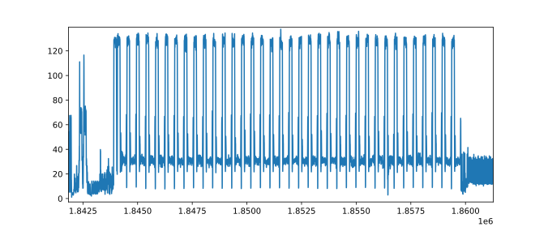
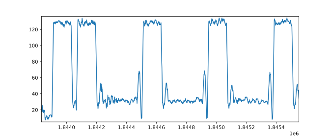

# Return of ECC dummy point addition: SPA on efficient P-256 implementation

The efficient implementation of the P-256 curve [1] rely on the introduction of dummy point additions to make the calculation constant-time.
In this repository, we provide a PoC that this implementation is vulnerable to Simple Power Analysis that reveals when the first point addition in a scalar multiplication is dummy (a particular case of SPA called Refined Power Analysis [2]).

This work has been presented at the [SSTIC 2021 conference](https://www.sstic.org/2021/presentation/return_of_ecc_dummy_point_additions_simple_power_analysis_on_efficient_p-256_implementation/) (presentation and paper are available on the link).

This project is licensed under the terms of the [GNU General Public License v3](https://www.gnu.org/licenses/gpl-3.0.en.html).

## Requirements

Running the experiment has several requirements:

* `TracerGrind` tool based on Valgrind ([SideChannelMarvels](https://github.com/SideChannelMarvels));
* `fpylll` the Python wrapper for `fplll` (https://pypi.org/project/fpylll/);
* `scikit-learn`, the machine learning tool of Python (https://scikit-learn.org/stable/).

## Build instructions

We provide a docker to make the installation easier.

1. Clone this repository
    ```bash
    git clone https://github.com/orangecertcc/security-research/simulations/ecdummyrpa.git
    ```
    
2. Then install our docker image:
    ```bash
    docker build -t ecdummyrpa ./ecdummyrpa
    ```
    
3. Now you can run the docker:
    ```bash
    docker run --privileged -it ecdummyrpa
    ```

## Running the PoC

### Key pair generation

The first step is to generate a pair of public/private ECDSA key on the P-256 curve:

```bash
openssl ecparam -genkey -name prime256v1 -out privkey.pem
openssl ec -in privkey.pem -pubout -out pubkey.pem
```

### Launch the simulation

Once everything is set, the simulation can be run with the Python script `simulation.py`.

```bash
python3 simulation.py -b <path_to_openssl> --privkey <private key> --working-dir <directory>  -n <number of signatures> --bounds <start> <end>
```

The argument `--bounds` is there to specify which part of the trace to keep to avoid storage of many unecessary parts of the trace. This is the only optional argument; by default, the whole trace is kept.
What can be done is run the command once with the option `-n 1` and look approximatively with `matplotlib.pyplot` the interesting part of the trace, and run again with the desired bounds.

For each signature, a message is signed with the private key and a power trace is simulated from the values read from memory during the calculations, thanks to the `TracerGrind` tool provided by SideChannelMarvels.

All signatures, messages and traces are stored in the working directory with the naming convention `message_1728.txt`, `signature_1728.bin`, and `trace_1728.txt` (numbering start from 0).

### Trace analysis and lattice attack

Finally, we can try and find the private key from the traces, signatures and the public key.
For that, run the command

```bash
python3 analysis.py --pubkey <public key> --working-dir <directory> -n <number of signatures> --bounds <start> <end>
```

The `bounds` argument is similar as in the simulation script, but here it is used to compare the traces in two classes: 

- First point addition is dummy;
- First point addition is **not** dummy

The attack should work best when the analysis is done on the part concerning the **first** point addition.

### Complete example

We run the simulation for one signature generation first:

```bash
python3 simulation.py -b /usr/local/bin/openssl --privkey privkey.pem --working-dir test -n 1
```

The directory `test` contains a trace called `trace_0.txt`. On each line is a measurement (modeled from the Hamming weight values read from memory, averaged with their surrounding values).

Let's take a look at the graph (with `matplotlib.pyplot` in Python).



This part of the trace is the scalar multiplication. Below we zoom at the beginning that corresponds to the first point additions.



The part that we are interested is the valley on the left between the positions approximatively `1844200` and `1844500`.

We run again the simulation, but this time 6000 times and with bounds.

```bash
python3 simulation.py -b /usr/local/bin/openssl --privkey privkey.pem --working-dir test -n 6000 --bounds 1844200 1844500
```

This is the longest part of the simulation, expect a few hours.

> To keep the trace for the whole scalar multiplication, we could have used `--bounds 1843850 1860000` instead. It would still be possible to run the analysis with a smaller part of the trace with the analysis tool later.

Once this is done, we run the analysis with the command:

```bash
python3 analysis.py --pubkey pubkey.pem --working-dir test -n 6000
```

> We have already traces reduced to the first point addition. Use the `--bounds` optional argument in case the traces cover more than this part of the calculation.

The results are obtained in a few seconds.

```
Loading 6000 traces...
Clustering of the traces...
Size of clusters: 5950, 50
Lattice attack: recovering of the key with 37 signatures...
Lattice attack: recovering of the key with 38 signatures...
SUCCESS!
The private key is deb867c4cf52002d7d8cc2e440d16c8c75c7844fdb142ea8c1a1f48b411b0251
```

The tool identified 50 traces out of the 6000 to be used in the lattice attack.
It failed with the first 37 signatures, but succeeded with the first 38.

> The file `sample.tar.gz` contains the traces, signatures, messages and the public key of this example.


## References

[1] Shay Gueron and Vlad Krasnov. Fast prime field elliptic-curve cryptography with 256-bit primes, *J. Cryptogr. Eng.*, 2015, [DOI 10.1007/s13389-014-0090-x](https://doi.org/10.1007/s13389-014-0090-x)

[2] Louis Goubin. A Refined Power-Analysis Attack on Elliptic Curve Cryptosystems, *PKC*, 2003, [DOI 10.1007/3-540-36288-6_15](https://doi.org/10.1007/3-540-36288-6_15)

